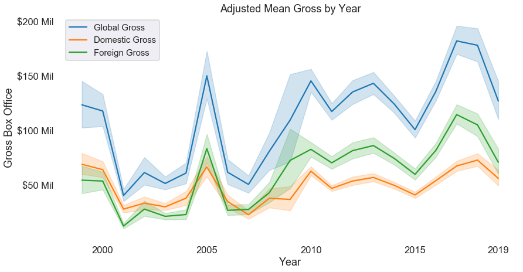
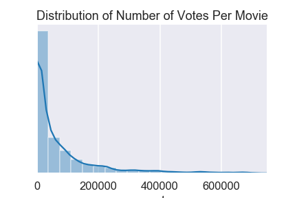
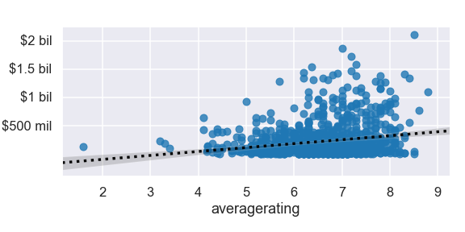
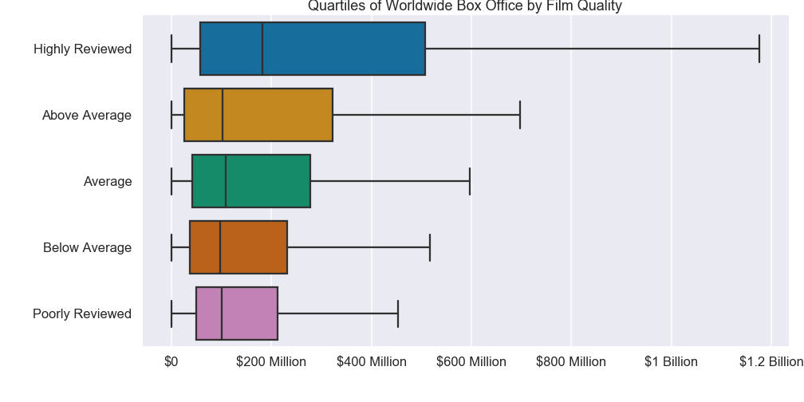
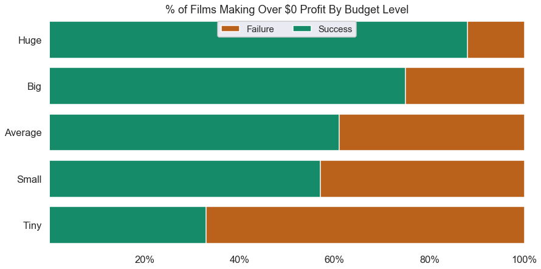
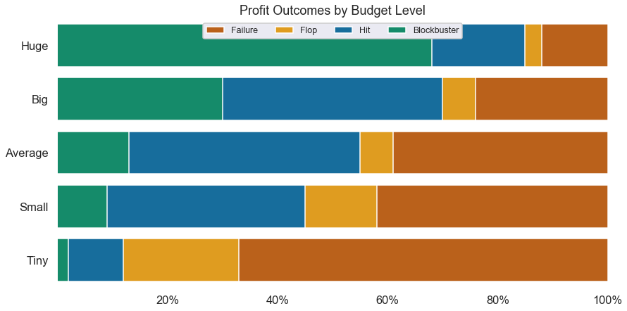
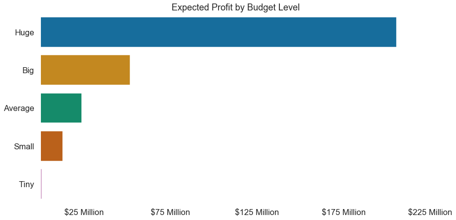
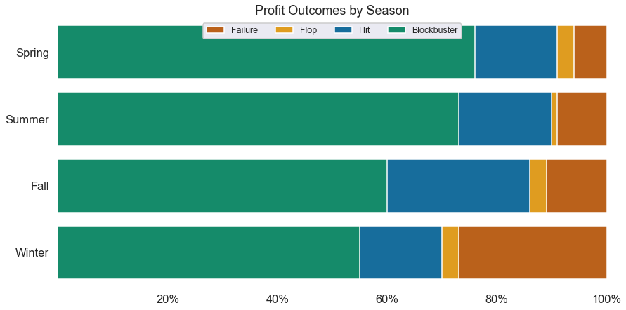
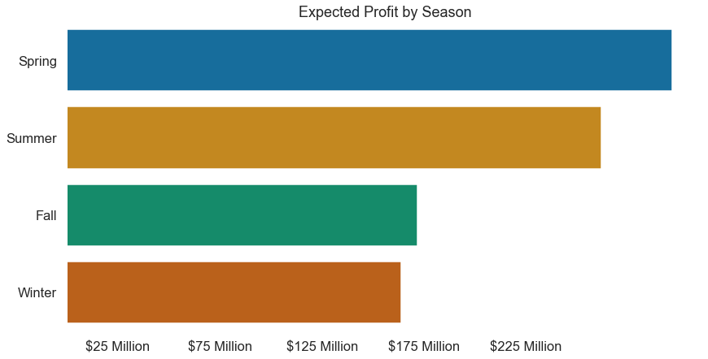

# Module 1 Project

Goal: Analyze film data to present a concise representation of the movie industry, analyze the success of movies based on various factors, and provide insights and reccomendations for the development of film projects.

Methodology:
    
1. Explore the data to determine questions to investigate.
2. Determine 3 relevant questions to examine. 
3. Clean the data. 
4. Restructure the data so that it can be analyzed.
5. Use data visualizations and statistical analysis to make inferences.
6. Develop a presentation of findings.

# 1. Data Exploration

#### Investigate and Name Dataframes
I began data exploration by checking the contents of each file and assigning them to dataframes with descriptive names.

# Step 2- Determine Questions

I will measure success using two factors:
        
- Box Office Profit
- Audience Reviews
        
I will investigate the following questions:            

1. How much money should we invest?
2. What kinds of films should we produce?
3. When should they be released?
4. Who should we hire to produce it? 

# Step 3- Clean Data

#### Duplicates

I found duplicates in the rt_reviews dataframe and dropped them.

#### Null Values and Other Issues

I found substantial issues in most of the dataframes that needed addressing.

#### gross_profits

There were substantial null values. To find a replacement value that made sense I first took the median of domestic gross, and compared it with the median of domestic gross for only the films that had a foreign gross value. 

I then found that foreign gross contained several strings with commas. I searched the internet and found the correct values to confirm my hunch that they were also stadardized. Then I removed the commas and added the appropriate number of 0s.

I found that:
- The median 'domestic_gross' overall: 1,400,000 
- The median 'domestic_gross' for films without 'foreign_gross': 180,000.  
- The median 'domestic_gross' for films with 'foreign_gross': 16,500,000 
- The median 'foreign_gross' for films with values: 19,000,000.

Because films with a foreign_gross value are significantly larger than those with a null I preserved the shape of the values by using the ratio of 'domestic_gross' and 'foreign_gross' values to replace the nulls.

Finally, I dropped the studio data column and the remaining nulls because it was unecessary to my analysis and they were few in number, respectfully.

#### imdb_crew

I didn't need birth year column, so I dropped it.

In addition, I used death year to impute 'Working' or 'Passed' into the column 'Status' which we can use to determine if they are able to be hired in our production.

To replace the 'primary_profession' null values, I imputed the general term 'crew' because it may be helpful to know the impact these professionals had on movies even without knowing their specific role.

Finally, I dropped the remaining column because it was too incomplete.

#### imdb_alt_titles
I didn't use this information for my analysis.

#### imdb_details

The main useful information in this dataframe is the genres, with years and primary title as identifiers. For this analysis original_title and runtime will not be important information. 

I also dropped rows without genre data because its a relatively small slice of the dataframe.

#### imdb_creators

I calculated the percentage of missing values in this dataframe and determined that it was appropriate to simply drop them.

#### imdb_principals

I dropped the character and ordering columns because it wasn't relevant to my analysis and after looking at the data closer, the jobs column was redundant with the category column so I dropped it too.

#### imdb_ratings 

Already contained no null values.

#### rt_info

I dropped the columns for dvd_date, currency and studio. Then I dropped the remaining rows with null values because they contained categorical data that is difficult to replace, or were in such high quatities that imputing a median or mean would skew the data.

#### rt_reviews

The only information I wanted from this dataframe was fresh rating so I dropped the rest. 

#### tmdb 

Already contained no nulls.

#### budgets

The first thing I needed to do was convert each value from a string to a integer. I used a function because I had to do it for three separate columns.

```
def fix_values(budgets, col):
    """Convert strings with , and $ to integers."""
    broken_values = [value for value in budgets[col]]
    fixed_values = []
    for value in broken_values:
        fixed_values.append(int(value.replace(',','')
                                .replace('$','')))
    budgets[col] = fixed_values
```
    
Then I used the release date column to create a month and year column because that format suited my analysis better. 

Then, I added a foreign_gross column by subtracting domestic gross from the worldwide gross. 

Finally, I dropped the id column because it does not reference any of the other data I had.

# Step 4- Restructuring

I reviewed the data and organized it into a single dataframe to use for analysis.

Because the rotten tomatoes data doesn't have movie titles and it is a much smaller dataset than those with imdb ids, I chose not to move forward with it.

I also determined that I didn't need the 'imdb_creators' dataframe because that information is already in 'imdb_principals' and the 'gross_profits' dataframe does not contain production costs, so I didn't use it either. 

I created a master dataframe in five steps:

1. Create the main dataframe by joing imdb_details with imdb_ratings
2. Impute the names from 'imdb_crew' into 'imdb_principals to create a 'roles' dataframe.
3. Join the 'roles' dataframe to the main dataframe using tconst as an index.
4. Join the budgets dataframe using title as an index.
5. Drop any columns that are redundant or unecessary

In the end, I had a dataframe, movies, that had 2126 films for further analysis.

# Analysis

For analysis I started work in another notebook. I used the movies dataframe to analyze each question in isolation. 

### Feature Creation

Before doing any analysis, however, I had a few important features to create. The first was adjusted the financial information for inflation. I based my estimated adjusted inflation on an average inflation rate of 3.16% per year over the last 100 years.

To do this I created a dictionary with values for the estimated conversion ratio for each year. Then I defined a function that would multiply a value by it's infflation ratio and return the new value.

```
def adjust(value, year):
    """Return inflation adjusted value."""
    return round(value*infl_dict[year], 2)
```

I also added a profit column that simply subtracted production budget from worldwide gross.

## Background

The goal of the background section is look at trends of the industry overall and to to define the threshold I will use to define success throughout the analysis.

#### Industry Trends

Because we're most interested in recent trends, I investigated trends over the last 20 years. 

First I observed how profits have changed in the last 20 years. I used average profit rather than totals to account for differences in the amount of movies in the data for each year. 



I observed that foreign gross seems to be making a larger and larger impact on total worldwide gross in the past 20 years. That is a trend worth noticing.

I found that the proportion of gross box office coming from foreign markets has grown from 43% from 1999-2003, to 60% from 2014-2018.

#### Profit- Defining Success


I discovered that the median adjusted profit for films is $14,787,479.62 and the mean is $95,689,612.93. The distribution of those profits, however, is tightly bunched around 0.

I decided next to divide the profit distribution into quartiles so that it could be visualized more easily. I found that:

- Top 25% of films made more than: $92,843,958.34
- Top 50% of films made more than: $14,787,479.62
- Top 75% of films made more than: -$2,402,409.2
- 100% of films made more than: -200,237,650.0

Next, I applied some rounded values based on that distribution to determine 4 different levels of profit outcome:

- Films with over $100 Million Dollars Profit: 514(24.18%)
- Films with over $15 Million Dollars Profit: 545(25.63%)
- Films with less than $15 Million Dollars Profit: 276(12.98%)
- Films that lost money: 791(37.21%)

I then gave these categories names, Blockbuster, Hit, Flop and Failure, such that the distribution looked like this:


So the distribution in the histogram of profits can be explained by the wide spread of profits in the top half of the sample, compared to the bunching around 0 in the bottom half. Using categorical data paints a much clearer picture of the data. I can use the 15 million dollar threshold to differentiate between success and failure, while targeting profits of over 100 million.

#### Audience Rating- Determining Success

To determine how to define success when it comes to audience rating, I had to answer two questions at once:

- Do postive ratings lead to bigger box office returns?
- What rating threshold should we aim for? 

To answer these questions I compared worldwide box office to the average rating of the films. Worldwide gross is more appropriate than profit because the heart of the question doesn't rely on whether the movie made money, but rather whether more people go to see movies of high quality. Intuition says that they do, but if that intuition is correct the data will serve to back it up.

First I analyzed whether the relationship is strong between movies in general and global gross, then I took a slice of the most popular movies and observed if the pattern held true.


Mean: 6.24
Median: 6.3
Max: 9.1
Min: 1.6

The ratings are roughly normally distributed around a mean of 6.24. Next I compared the reviews to the worldwide gross of using a scatterplot.


There is a hint of positive correlation suggesting that higher quality films make more money. Next I looked at quantile data to separate the ratings into 5 quality levels so I could look at the data categorically.

- Top 20% of films average rating > 7.1
- Top 40% of films average rating > 6.6
- Top 60% of films average rating > 6.1
- Top 80% of films average rating > 5.4
- 100% of films average rating > 1.6

The minimum rating is somewhat of an outlier, and the vast majority of the ratings are within the middle 40% of data. This reflects the normal distribution above.

I looked at the relationship between film quality and box office gross and found a clear correlation, but what if many of the films in this dataset are relatively unknown? Because we are seeking to invest in films with a broad audience we'll have to investigate if the pattern of high quality movies making more money holds true for more popular movies. So, I utilized the numvotes column to investigate if the pattern held true for movies that receved a lot of votes. I began with an analysis of the distribution of votes:

- Mean: 80666.36
- Median: 80666.36
- 25% films received at least 92676.75 votes.
- 50% films received at least 24903.5 votes.
- 75% films received at least 1502.67 votes.
- 90% films received at least 100.0 votes.



I used that to determine a threshold of 25000 votes was appropriate as it would include the top 50% most voted for films.



Although there are still many well reviewed movies that made less money, the trend is even more clear with this slice of the data. To finish up my analysis I looked at this slice categorically.



Since it is pretty clear from this data that the higher quality a film the more money it makes I determined that audience rating was a valid measure of success.

# Background Conclusion

The movie industry is growing, especially due to the increase in foreign box office returns. To determine success for the remainder of the analysis we will be using the thresholds described above and summarized here.

#### Profit

- Blockbuster-  > 100 million dollars profit
- Hit-          > 10 million dollars profit
- Flop-         < 10 million dollars profit
- Failure-      < 0 dollars profit

#### Quality

- Highly Reviewed-  average rating > 7.1
- Above Average-    average rating > 6.6
- Average-          average rating > 6.1
- Below Average-    average rating > 5.4
- Poorly Reviewed-  average rating > 1.6

# Question 1

#### How much money should be invested?
##### 1a. Does higher production budget lead to higher rating?
##### 1b. Which investment level leads to the highest profits?
##### 1c. What amount of risk come with different investment levels?

For this analysis I used audience rating and profit. Both of these factors will be compared to production costs so I can reccomend a target investment amount per film. 

First examined the distribution of profits.

- Mean: 45,763,179.17
- Median: 22,965,043.25


An once again divided the data into 5 categories.

- The top 20% of movies by cost spend at least $71,490,309.78 (huge)
- The top 40% of movies by cost spend at least $32,843,038.68 (big)
- The top 60% of movies by cost spend at least $15,104,303.98 (average)
- The top 80% of movies by cost spend at least $4,094,817.87 (small)
- Movies that spent less than $4,094,817.87 (tiny)

### Question 1a. 

When it comes to production budget, does spending more lead to a higher quality movie? To answer this I drew a simple scatter plot and observed the distibution of the values:


By category:


Investment in any budget range can result in a high quality film. Looking at the left whiskers of the boxes though, it seems that huge bugdets may be a more reliable investment.

### Question 1b

Is it better to release several films with a given budget or throw it all into one big blockbuster? To answer this I assessed a scatter plot of production budget by profit:


The scatter plot shows a positve correlation, I also checked that observation with categorical data:


### Question 1c

To understand the risks associated with a film I calculated the expected return on investment of a film by dividing the worldwide gross by the production budget of each film.

Upon closer look at the data though, an interesting problem arose. Outliers were clearly affecting the data in a massive way. 

*Without Outliers*


*With Outliers*


Although it will be interesting to investigate this further in future work, I determined that it would be most effective to use profit for the purposes of the this analysis.

Based on $0 Threshold:

Overall Success Rate is 63%.

- Huge(over ~70 mil)   :88%
- Big(over ~30mil)     :75%
- Average(over ~15mil) :61%
- Small(over ~4mil)    :57%
- Tiny(under ~4mil)    :33%



Based on $15,000,000 Threshold:

Overall Success Rate is 50%

- Huge(over ~70 mil)   :84%
- Big(over ~30mil)     :67%
- Average(over ~15mil) :52%
- Small(over ~4mil)    :38%
- Tiny(under ~4mil)    :9%


I analyzed budgets based on these tiers.



This gave me a clear understanding that movies with a huge budget were most successful, but it did not account for the fact that those films also risk the most if they fail. To examine this issue I calculated expected profits by by multiplying median loss and gain with the simple % chance that kind of movie made or lost money.  




# Question 1 Conclusion

The budget level with the highest potential for profit is huge, somewhat counterintuitively it also has the lowest risk. Aside from a few outliers in the smaller budget categories this holds true for return on investment. 

Finally, over the course of many films blockbusters provide the highest expected profit by far. Given the potential risks of failure however, and the fact that big budget films still perform fairly well, my recommendation is that we invest in films with production budgets no less than $50 million dollars. 

# Question 2

#### What kind of films should we produce?
- Once we know what kind of film, when should we release it?

Next my analysis shifted to analyzing genre. Because of the fact that a film can have more than one genre the sample size will be expanded. I can split each film into an entry for each genre that it represents.

To create a new dataframe with genre data, first I split the existing genre entry into lists of strings and used those lists to populate a three new columns. I then created three dataframes grouped by those columns and concatenated them to create a master dataframe with an entry for every genre represented in the dataset. Finally, I used my judgment to combine the 22 genres into a more managable 16 with corresponding number of appearances:

- Drama                1195
- Comedy                724
- Action                598
- Crime/Mystery         562
- Adventure             459
- Thriller              456
- Horror                334
- History/Biography     301
- Romance               300
- Sci-Fi                202
- Documentary           191
- Fantasy               169
- Family                140
- Animation             130
- Musical/Music          94
- Sport                  60

I used the new dataframe to plot the profit by genre:


and the production costs by genre:


This gave an idea of what genres of movies perform well, as well as their average production budgets. Interestingly, animated and adventure movies stood out in both charts. 

As analysis above found, performing well in foreign markets is crucial for a successful movie. So, I compared success of genres in domestic and foreign markets.


I then analyzed the genre data based on profit outcomes.


# Question 2 Conclusion

There are eight genres that have an above average success rate (Animation, Adventure, Sci-Fi, Action, Fantasy, Family, Comedy, Romance). Of those eight, six have an expected profit above 50 million dollars (Animation, Adventure, Sci-Fi, Action, Fantasy, Family). Of those six, three have an expected profit above 100 million dollars (Animation, Adventure, Sci-Fi). 

My reccomendation is to invest in films from those top six genres, and preferably the top 3. In addition to having the highest expected profits, these genres also rank in the top 6 for production costs, which we already saw is correlated with success. They also show popularity in foreign markets. 

# Question 3

#### When should we release the film?

To know when to release a film I analyzed the month by month data. I split it into four seasons to compare which season is the best to release films overall. 


Then I narrowed focus to only those films that satisfy the previously observed optimal conditions: 
1)having a production cost of over 50 million dollars and 
2)being of the Animation, Adventure, Sci-Fi, Action, Fantasy, or Family genres.

There are 457 films in the target subgroup.





# Question 3 Conclusion

Judging by the output of the analysis, it seems the best time to release the recommended types of films is the Spring or Summer.

# Question 4

#### Who should we hire?

I analyzed this question by exploring the data on movie professionals. Then, I sliced the data to find a top 10 list for particular roles for the kind of movie we want to make.

I found the number of professionals in each role:

- actor                  6829
- producer               4783
- actress                4102
- writer                 3991
- director               2985
- composer               1683
- cinematographer        1251
- editor                  762
- self                    351
- production_designer     244
- archive_footage          16
- archive_sound             1

I used that information to determine that I would analyze data for actors, actresses, director, producers, and writers.

To narrow down the most successful people I first sliced away anyone with that has passed away. 

Then, I sliced only people who's movies have performed in the 'successful' range. To do that I grouped the dataframe by people's names, gathering the total boxoffice and average rating. 

Then I filtered out people whose films have rated below the threshold for success, 6.3.

Finally, I took the top 10 people sorted by total profit and plot their numbers on a scatterplot showing their average audience rating. The size of the plot point shows their average film profit. 

Here is the output:


# Question 4 Conclusion

Due to systemic biases it is important to note that the use of historical data should not be the only factor we use to hire cast and crew for a film. Although I can use the data to make a reccomendation, it is also important to recommend that we seek out diverse viewpoints and perspectives. This analysis is limited by the data it uses to automatically include historical biases that influence who has created successful films.  